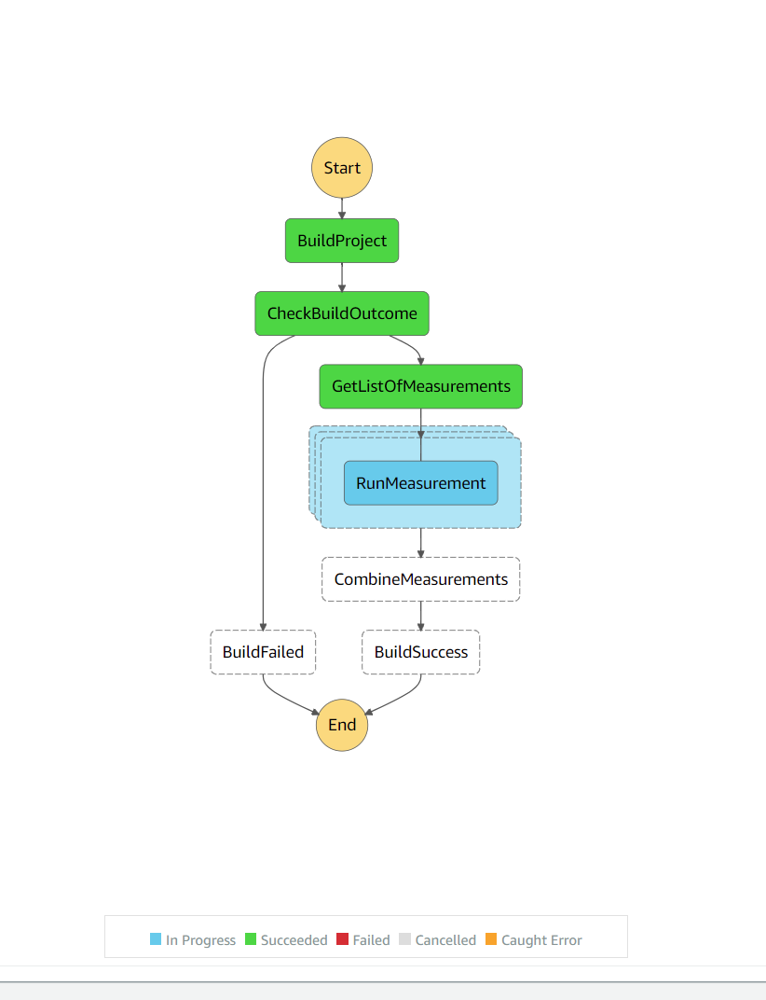

# Methodology

This document describes how Lambda measurements are performed.

## Compilation

Each function is compiled with the following settings.

|Runtime        |Architecture   |Tiered Compilation |ReadyToRun |PreJIT |
|---------------|---------------|-------------------|-----------|-------|
|.NET 6.0       |arm64          |no                 |no         |no     |
|.NET 6.0       |arm64          |yes                |no         |no     |
|.NET 6.0       |arm64          |no                 |yes        |no     |
|.NET 6.0       |arm64          |yes                |yes        |no     |
|.NET Core 3.1  |arm64          |no                 |no         |no     |
|.NET Core 3.1  |arm64          |yes                |no         |no     |
|.NET Core 3.1  |arm64          |no                 |yes        |no     |
|.NET Core 3.1  |arm64          |yes                |yes        |no     |
|.NET 6.0       |x86-64         |no                 |no         |no     |
|.NET 6.0       |x86-64         |yes                |no         |no     |
|.NET 6.0       |x86-64         |no                 |yes        |no     |
|.NET 6.0       |x86-64         |yes                |yes        |no     |
|.NET Core 3.1  |x86-64         |no                 |no         |no     |
|.NET Core 3.1  |x86-64         |yes                |no         |no     |
|.NET Core 3.1  |x86-64         |no                 |yes        |no     |
|.NET Core 3.1  |x86-64         |yes                |yes        |no     |
|.NET 6.0       |arm64          |no                 |no         |yes    |
|.NET 6.0       |arm64          |yes                |no         |yes    |
|.NET 6.0       |arm64          |no                 |yes        |yes    |
|.NET 6.0       |arm64          |yes                |yes        |yes    |
|.NET Core 3.1  |arm64          |no                 |no         |yes    |
|.NET Core 3.1  |arm64          |yes                |no         |yes    |
|.NET Core 3.1  |arm64          |no                 |yes        |yes    |
|.NET Core 3.1  |arm64          |yes                |yes        |yes    |
|.NET 6.0       |x86-64         |no                 |no         |yes    |
|.NET 6.0       |x86-64         |yes                |no         |yes    |
|.NET 6.0       |x86-64         |no                 |yes        |yes    |
|.NET 6.0       |x86-64         |yes                |yes        |yes    |
|.NET Core 3.1  |x86-64         |no                 |no         |yes    |
|.NET Core 3.1  |x86-64         |yes                |no         |yes    |
|.NET Core 3.1  |x86-64         |no                 |yes        |yes    |
|.NET Core 3.1  |x86-64         |yes                |yes        |yes    |

Compilation is performed by CodeBuild with teh following `buildspec.yml` file.

```yaml
version: 0.2
env:
  shell: bash
  variables:
    DOTNET_SDK_URL: "https://download.visualstudio.microsoft.com/download/pr/c505a449-9ecf-4352-8629-56216f521616/bd6807340faae05b61de340c8bf161e8/dotnet-sdk-6.0.201-linux-x64.tar.gz"

phases:
  install:
    runtime-versions:
      dotnet: 3.1
    on-failure: ABORT
    commands:
      - curl $DOTNET_SDK_URL -o dotnet-sdk-6.tar.gz
      - mkdir -p $HOME/dotnet
      - tar zxf dotnet-sdk-6.tar.gz -C $HOME/dotnet
      - export DOTNET_ROOT=$HOME/dotnet
      - export PATH=$HOME/dotnet:$PATH
      - dotnet --version

  build:
    on-failure: ABORT
    commands:
      - chmod +x build.sh
      - ./build.sh

artifacts:
  files:
    - "*.zip"
    - "*.log"
    - "*.json"
  base-directory: publish
```

## Deployment

Each compiled function is then deployed as an AWS Lambda function in `us-west-2` with the following configurations.

|Memory |
|-------|
|128    |
|256    |
|512    |
|1024   |
|1769   |

## Execution

Each deployed Lambda is forced to execute 100 cold starts by modifying its environment variables. Each cold start is then followed by 25 warm invocations.

Measurements are obtained by parsing the `REPORT` statement from the returned CloudWatch log.
```
REPORT RequestId: 7234b561-1e51-45f4-a031-a71b9836f038	Duration: 327.16 ms	Billed Duration: 328 ms	Memory Size: 256 MB	Max Memory Used: 61 MB	Init Duration: 243.54 ms
```

## Result

The measurements are then tallied into a CSV file.

TODO: update description
```csv
Project,Build,Runtime,Architecture,Tiered,Ready2Run,ZipSize,MemorySize,Sample,Runs,Init,Used-01,Used-02,Used-03,Used-04,Used-05,Used-06,Used-07,Used-08,Used-09,Used-10,Used-11,Used-12,Used-13,Used-14,Used-15,Used-16,Used-17,Used-18,Used-19,Used-20,Used-21,Used-22,Used-23,Used-24,Used-25
Minimal,Minimal-Core31-Arm64-NoTC-NoR2R-1024,dotnetcore3.1,arm64,no,no,17818,1024,2,26,160.41,9.5,1.12,0.92,0.97,0.86,0.75,0.85,0.94,1.02,0.75,0.77,0.84,0.84,0.73,0.74,0.75,0.68,0.73,0.74,0.75,0.73,0.78,0.85,0.77,0.66,0.71
Minimal,Minimal-Core31-Arm64-NoTC-NoR2R-1024,dotnetcore3.1,arm64,no,no,17818,1024,3,26,160.68,9.61,0.93,0.71,0.8,0.76,0.78,0.75,0.74,0.7,0.74,0.68,0.77,0.76,0.64,0.76,0.72,0.76,0.66,0.72,0.68,0.69,0.76,0.72,0.78,0.73,0.63
```

## Implementation

The measurement process kicked off by uploading a `.zip` file of a .NET project to an S3 bucket. This triggers a Lambda function to execute a Step Function, which triggers the build and concurrent execution of measurements. The Step Function allows up to 10 concurrent measurements.



## JSON Serializer Measurements

A large, complex data-structure is required to measure the performance difference between the different JSON serializer implementations. To this end, we used the repository response from the [GitHub API](https://docs.github.com/en/rest/reference/repos).

```json
 {
  "url": "https://api.github.com/repos/octocat/Hello-World/pulls/1347",
  "id": 1,
  "node_id": "MDExOlB1bGxSZXF1ZXN0MQ==",
  "html_url": "https://github.com/octocat/Hello-World/pull/1347",
  "diff_url": "https://github.com/octocat/Hello-World/pull/1347.diff",
  "patch_url": "https://github.com/octocat/Hello-World/pull/1347.patch",
  "issue_url": "https://api.github.com/repos/octocat/Hello-World/issues/1347",
  "commits_url": "https://api.github.com/repos/octocat/Hello-World/pulls/1347/commits",
  "review_comments_url": "https://api.github.com/repos/octocat/Hello-World/pulls/1347/comments",
  "review_comment_url": "https://api.github.com/repos/octocat/Hello-World/pulls/comments{/number}",
  "comments_url": "https://api.github.com/repos/octocat/Hello-World/issues/1347/comments",
  "statuses_url": "https://api.github.com/repos/octocat/Hello-World/statuses/6dcb09b5b57875f334f61aebed695e2e4193db5e",
  "number": 1347,
  "state": "open",
  "locked": true,
  "title": "Amazing new feature",
  "user": {
    "login": "octocat",
    "id": 1,
    "node_id": "MDQ6VXNlcjE=",
    "avatar_url": "https://github.com/images/error/octocat_happy.gif",
    "gravatar_id": "",
    "url": "https://api.github.com/users/octocat",
    "html_url": "https://github.com/octocat",
    "followers_url": "https://api.github.com/users/octocat/followers",
    "following_url": "https://api.github.com/users/octocat/following{/other_user}",
    "gists_url": "https://api.github.com/users/octocat/gists{/gist_id}",
    "starred_url": "https://api.github.com/users/octocat/starred{/owner}{/repo}",
    "subscriptions_url": "https://api.github.com/users/octocat/subscriptions",
    "organizations_url": "https://api.github.com/users/octocat/orgs",
    "repos_url": "https://api.github.com/users/octocat/repos",
    "events_url": "https://api.github.com/users/octocat/events{/privacy}",
    "received_events_url": "https://api.github.com/users/octocat/received_events",
    "type": "User",
    "site_admin": false
  },
  "body": "Please pull these awesome changes in!",
  "labels": [
    {
      "id": 208045946,
      "node_id": "MDU6TGFiZWwyMDgwNDU5NDY=",
      "url": "https://api.github.com/repos/octocat/Hello-World/labels/bug",
      "name": "bug",
      "description": "Something isn't working",
      "color": "f29513",
      "default": true
    }
  ],
  "milestone": {
    "url": "https://api.github.com/repos/octocat/Hello-World/milestones/1",
    "html_url": "https://github.com/octocat/Hello-World/milestones/v1.0",
    "labels_url": "https://api.github.com/repos/octocat/Hello-World/milestones/1/labels",
    "id": 1002604,
    "node_id": "MDk6TWlsZXN0b25lMTAwMjYwNA==",
    "number": 1,
    "state": "open",
    "title": "v1.0",
    "description": "Tracking milestone for version 1.0",
    "creator": {
      "login": "octocat",
      "id": 1,
      "node_id": "MDQ6VXNlcjE=",
      "avatar_url": "https://github.com/images/error/octocat_happy.gif",
      "gravatar_id": "",
      "url": "https://api.github.com/users/octocat",
      "html_url": "https://github.com/octocat",
      "followers_url": "https://api.github.com/users/octocat/followers",
      "following_url": "https://api.github.com/users/octocat/following{/other_user}",
      "gists_url": "https://api.github.com/users/octocat/gists{/gist_id}",
      "starred_url": "https://api.github.com/users/octocat/starred{/owner}{/repo}",
      "subscriptions_url": "https://api.github.com/users/octocat/subscriptions",
      "organizations_url": "https://api.github.com/users/octocat/orgs",
      "repos_url": "https://api.github.com/users/octocat/repos",
      "events_url": "https://api.github.com/users/octocat/events{/privacy}",
      "received_events_url": "https://api.github.com/users/octocat/received_events",
      "type": "User",
      "site_admin": false
    },
    "open_issues": 4,
    "closed_issues": 8,
    "created_at": "2011-04-10T20:09:31Z",
    "updated_at": "2014-03-03T18:58:10Z",
    "closed_at": "2013-02-12T13:22:01Z",
    "due_on": "2012-10-09T23:39:01Z"
  },
  "active_lock_reason": "too heated",
  "created_at": "2011-01-26T19:01:12Z",
  "updated_at": "2011-01-26T19:01:12Z",
  "closed_at": "2011-01-26T19:01:12Z",
  "merged_at": "2011-01-26T19:01:12Z",
  "merge_commit_sha": "e5bd3914e2e596debea16f433f57875b5b90bcd6",
  "assignee": {
    "login": "octocat",
    "id": 1,
    "node_id": "MDQ6VXNlcjE=",
    "avatar_url": "https://github.com/images/error/octocat_happy.gif",
    "gravatar_id": "",
    "url": "https://api.github.com/users/octocat",
    "html_url": "https://github.com/octocat",
    "followers_url": "https://api.github.com/users/octocat/followers",
    "following_url": "https://api.github.com/users/octocat/following{/other_user}",
    "gists_url": "https://api.github.com/users/octocat/gists{/gist_id}",
    "starred_url": "https://api.github.com/users/octocat/starred{/owner}{/repo}",
    "subscriptions_url": "https://api.github.com/users/octocat/subscriptions",
    "organizations_url": "https://api.github.com/users/octocat/orgs",
    "repos_url": "https://api.github.com/users/octocat/repos",
    "events_url": "https://api.github.com/users/octocat/events{/privacy}",
    "received_events_url": "https://api.github.com/users/octocat/received_events",
    "type": "User",
    "site_admin": false
  },
  "assignees": [
    {
      "login": "octocat",
      "id": 1,
      "node_id": "MDQ6VXNlcjE=",
      "avatar_url": "https://github.com/images/error/octocat_happy.gif",
      "gravatar_id": "",
      "url": "https://api.github.com/users/octocat",
      "html_url": "https://github.com/octocat",
      "followers_url": "https://api.github.com/users/octocat/followers",
      "following_url": "https://api.github.com/users/octocat/following{/other_user}",
      "gists_url": "https://api.github.com/users/octocat/gists{/gist_id}",
      "starred_url": "https://api.github.com/users/octocat/starred{/owner}{/repo}",
      "subscriptions_url": "https://api.github.com/users/octocat/subscriptions",
      "organizations_url": "https://api.github.com/users/octocat/orgs",
      "repos_url": "https://api.github.com/users/octocat/repos",
      "events_url": "https://api.github.com/users/octocat/events{/privacy}",
      "received_events_url": "https://api.github.com/users/octocat/received_events",
      "type": "User",
      "site_admin": false
    },
    {
      "login": "hubot",
      "id": 1,
      "node_id": "MDQ6VXNlcjE=",
      "avatar_url": "https://github.com/images/error/hubot_happy.gif",
      "gravatar_id": "",
      "url": "https://api.github.com/users/hubot",
      "html_url": "https://github.com/hubot",
      "followers_url": "https://api.github.com/users/hubot/followers",
      "following_url": "https://api.github.com/users/hubot/following{/other_user}",
      "gists_url": "https://api.github.com/users/hubot/gists{/gist_id}",
      "starred_url": "https://api.github.com/users/hubot/starred{/owner}{/repo}",
      "subscriptions_url": "https://api.github.com/users/hubot/subscriptions",
      "organizations_url": "https://api.github.com/users/hubot/orgs",
      "repos_url": "https://api.github.com/users/hubot/repos",
      "events_url": "https://api.github.com/users/hubot/events{/privacy}",
      "received_events_url": "https://api.github.com/users/hubot/received_events",
      "type": "User",
      "site_admin": true
    }
  ],
  "requested_reviewers": [
    {
      "login": "octocat",
      "id": 1,
      "node_id": "MDQ6VXNlcjE=",
      "avatar_url": "https://github.com/images/error/octocat_happy.gif",
      "gravatar_id": "",
      "url": "https://api.github.com/users/octocat",
      "html_url": "https://github.com/octocat",
      "followers_url": "https://api.github.com/users/octocat/followers",
      "following_url": "https://api.github.com/users/octocat/following{/other_user}",
      "gists_url": "https://api.github.com/users/octocat/gists{/gist_id}",
      "starred_url": "https://api.github.com/users/octocat/starred{/owner}{/repo}",
      "subscriptions_url": "https://api.github.com/users/octocat/subscriptions",
      "organizations_url": "https://api.github.com/users/octocat/orgs",
      "repos_url": "https://api.github.com/users/octocat/repos",
      "events_url": "https://api.github.com/users/octocat/events{/privacy}",
      "received_events_url": "https://api.github.com/users/octocat/received_events",
      "type": "User",
      "site_admin": false
    },
    {
      "login": "hubot",
      "id": 1,
      "node_id": "MDQ6VXNlcjE=",
      "avatar_url": "https://github.com/images/error/hubot_happy.gif",
      "gravatar_id": "",
      "url": "https://api.github.com/users/hubot",
      "html_url": "https://github.com/hubot",
      "followers_url": "https://api.github.com/users/hubot/followers",
      "following_url": "https://api.github.com/users/hubot/following{/other_user}",
      "gists_url": "https://api.github.com/users/hubot/gists{/gist_id}",
      "starred_url": "https://api.github.com/users/hubot/starred{/owner}{/repo}",
      "subscriptions_url": "https://api.github.com/users/hubot/subscriptions",
      "organizations_url": "https://api.github.com/users/hubot/orgs",
      "repos_url": "https://api.github.com/users/hubot/repos",
      "events_url": "https://api.github.com/users/hubot/events{/privacy}",
      "received_events_url": "https://api.github.com/users/hubot/received_events",
      "type": "User",
      "site_admin": true
    },
    {
      "login": "other_user",
      "id": 1,
      "node_id": "MDQ6VXNlcjE=",
      "avatar_url": "https://github.com/images/error/other_user_happy.gif",
      "gravatar_id": "",
      "url": "https://api.github.com/users/other_user",
      "html_url": "https://github.com/other_user",
      "followers_url": "https://api.github.com/users/other_user/followers",
      "following_url": "https://api.github.com/users/other_user/following{/other_user}",
      "gists_url": "https://api.github.com/users/other_user/gists{/gist_id}",
      "starred_url": "https://api.github.com/users/other_user/starred{/owner}{/repo}",
      "subscriptions_url": "https://api.github.com/users/other_user/subscriptions",
      "organizations_url": "https://api.github.com/users/other_user/orgs",
      "repos_url": "https://api.github.com/users/other_user/repos",
      "events_url": "https://api.github.com/users/other_user/events{/privacy}",
      "received_events_url": "https://api.github.com/users/other_user/received_events",
      "type": "User",
      "site_admin": false
    }
  ],
  "requested_teams": [
    {
      "id": 1,
      "node_id": "MDQ6VGVhbTE=",
      "url": "https://api.github.com/teams/1",
      "html_url": "https://github.com/orgs/github/teams/justice-league",
      "name": "Justice League",
      "slug": "justice-league",
      "description": "A great team.",
      "privacy": "closed",
      "permission": "admin",
      "members_url": "https://api.github.com/teams/1/members{/member}",
      "repositories_url": "https://api.github.com/teams/1/repos",
      "parent": null
    }
  ],
  "head": {
    "label": "octocat:new-topic",
    "ref": "new-topic",
    "sha": "6dcb09b5b57875f334f61aebed695e2e4193db5e",
    "user": {
      "login": "octocat",
      "id": 1,
      "node_id": "MDQ6VXNlcjE=",
      "avatar_url": "https://github.com/images/error/octocat_happy.gif",
      "gravatar_id": "",
      "url": "https://api.github.com/users/octocat",
      "html_url": "https://github.com/octocat",
      "followers_url": "https://api.github.com/users/octocat/followers",
      "following_url": "https://api.github.com/users/octocat/following{/other_user}",
      "gists_url": "https://api.github.com/users/octocat/gists{/gist_id}",
      "starred_url": "https://api.github.com/users/octocat/starred{/owner}{/repo}",
      "subscriptions_url": "https://api.github.com/users/octocat/subscriptions",
      "organizations_url": "https://api.github.com/users/octocat/orgs",
      "repos_url": "https://api.github.com/users/octocat/repos",
      "events_url": "https://api.github.com/users/octocat/events{/privacy}",
      "received_events_url": "https://api.github.com/users/octocat/received_events",
      "type": "User",
      "site_admin": false
    },
    "repo": {
      "id": 1296269,
      "node_id": "MDEwOlJlcG9zaXRvcnkxMjk2MjY5",
      "name": "Hello-World",
      "full_name": "octocat/Hello-World",
      "owner": {
        "login": "octocat",
        "id": 1,
        "node_id": "MDQ6VXNlcjE=",
        "avatar_url": "https://github.com/images/error/octocat_happy.gif",
        "gravatar_id": "",
        "url": "https://api.github.com/users/octocat",
        "html_url": "https://github.com/octocat",
        "followers_url": "https://api.github.com/users/octocat/followers",
        "following_url": "https://api.github.com/users/octocat/following{/other_user}",
        "gists_url": "https://api.github.com/users/octocat/gists{/gist_id}",
        "starred_url": "https://api.github.com/users/octocat/starred{/owner}{/repo}",
        "subscriptions_url": "https://api.github.com/users/octocat/subscriptions",
        "organizations_url": "https://api.github.com/users/octocat/orgs",
        "repos_url": "https://api.github.com/users/octocat/repos",
        "events_url": "https://api.github.com/users/octocat/events{/privacy}",
        "received_events_url": "https://api.github.com/users/octocat/received_events",
        "type": "User",
        "site_admin": false
      },
      "private": false,
      "html_url": "https://github.com/octocat/Hello-World",
      "description": "This your first repo!",
      "fork": false,
      "url": "https://api.github.com/repos/octocat/Hello-World",
      "archive_url": "https://api.github.com/repos/octocat/Hello-World/{archive_format}{/ref}",
      "assignees_url": "https://api.github.com/repos/octocat/Hello-World/assignees{/user}",
      "blobs_url": "https://api.github.com/repos/octocat/Hello-World/git/blobs{/sha}",
      "branches_url": "https://api.github.com/repos/octocat/Hello-World/branches{/branch}",
      "collaborators_url": "https://api.github.com/repos/octocat/Hello-World/collaborators{/collaborator}",
      "comments_url": "https://api.github.com/repos/octocat/Hello-World/comments{/number}",
      "commits_url": "https://api.github.com/repos/octocat/Hello-World/commits{/sha}",
      "compare_url": "https://api.github.com/repos/octocat/Hello-World/compare/{base}...{head}",
      "contents_url": "https://api.github.com/repos/octocat/Hello-World/contents/{+path}",
      "contributors_url": "https://api.github.com/repos/octocat/Hello-World/contributors",
      "deployments_url": "https://api.github.com/repos/octocat/Hello-World/deployments",
      "downloads_url": "https://api.github.com/repos/octocat/Hello-World/downloads",
      "events_url": "https://api.github.com/repos/octocat/Hello-World/events",
      "forks_url": "https://api.github.com/repos/octocat/Hello-World/forks",
      "git_commits_url": "https://api.github.com/repos/octocat/Hello-World/git/commits{/sha}",
      "git_refs_url": "https://api.github.com/repos/octocat/Hello-World/git/refs{/sha}",
      "git_tags_url": "https://api.github.com/repos/octocat/Hello-World/git/tags{/sha}",
      "git_url": "git:github.com/octocat/Hello-World.git",
      "issue_comment_url": "https://api.github.com/repos/octocat/Hello-World/issues/comments{/number}",
      "issue_events_url": "https://api.github.com/repos/octocat/Hello-World/issues/events{/number}",
      "issues_url": "https://api.github.com/repos/octocat/Hello-World/issues{/number}",
      "keys_url": "https://api.github.com/repos/octocat/Hello-World/keys{/key_id}",
      "labels_url": "https://api.github.com/repos/octocat/Hello-World/labels{/name}",
      "languages_url": "https://api.github.com/repos/octocat/Hello-World/languages",
      "merges_url": "https://api.github.com/repos/octocat/Hello-World/merges",
      "milestones_url": "https://api.github.com/repos/octocat/Hello-World/milestones{/number}",
      "notifications_url": "https://api.github.com/repos/octocat/Hello-World/notifications{?since,all,participating}",
      "pulls_url": "https://api.github.com/repos/octocat/Hello-World/pulls{/number}",
      "releases_url": "https://api.github.com/repos/octocat/Hello-World/releases{/id}",
      "ssh_url": "git@github.com:octocat/Hello-World.git",
      "stargazers_url": "https://api.github.com/repos/octocat/Hello-World/stargazers",
      "statuses_url": "https://api.github.com/repos/octocat/Hello-World/statuses/{sha}",
      "subscribers_url": "https://api.github.com/repos/octocat/Hello-World/subscribers",
      "subscription_url": "https://api.github.com/repos/octocat/Hello-World/subscription",
      "tags_url": "https://api.github.com/repos/octocat/Hello-World/tags",
      "teams_url": "https://api.github.com/repos/octocat/Hello-World/teams",
      "trees_url": "https://api.github.com/repos/octocat/Hello-World/git/trees{/sha}",
      "clone_url": "https://github.com/octocat/Hello-World.git",
      "mirror_url": "git:git.example.com/octocat/Hello-World",
      "hooks_url": "https://api.github.com/repos/octocat/Hello-World/hooks",
      "svn_url": "https://svn.github.com/octocat/Hello-World",
      "homepage": "https://github.com",
      "language": null,
      "forks_count": 9,
      "stargazers_count": 80,
      "watchers_count": 80,
      "size": 108,
      "default_branch": "master",
      "open_issues_count": 0,
      "is_template": true,
      "topics": [
        "octocat",
        "atom",
        "electron",
        "api"
      ],
      "has_issues": true,
      "has_projects": true,
      "has_wiki": true,
      "has_pages": false,
      "has_downloads": true,
      "archived": false,
      "disabled": false,
      "visibility": "public",
      "pushed_at": "2011-01-26T19:06:43Z",
      "created_at": "2011-01-26T19:01:12Z",
      "updated_at": "2011-01-26T19:14:43Z",
      "permissions": {
        "admin": false,
        "push": false,
        "pull": true
      },
      "allow_rebase_merge": true,
      "template_repository": null,
      "temp_clone_token": "ABTLWHOULUVAXGTRYU7OC2876QJ2O",
      "allow_squash_merge": true,
      "allow_auto_merge": false,
      "delete_branch_on_merge": true,
      "allow_merge_commit": true,
      "subscribers_count": 42,
      "network_count": 0,
      "license": {
        "key": "mit",
        "name": "MIT License",
        "url": "https://api.github.com/licenses/mit",
        "spdx_id": "MIT",
        "node_id": "MDc6TGljZW5zZW1pdA==",
        "html_url": "https://github.com/licenses/mit"
      },
      "forks": 1,
      "open_issues": 1,
      "watchers": 1
    }
  },
  "base": {
    "label": "octocat:master",
    "ref": "master",
    "sha": "6dcb09b5b57875f334f61aebed695e2e4193db5e",
    "user": {
      "login": "octocat",
      "id": 1,
      "node_id": "MDQ6VXNlcjE=",
      "avatar_url": "https://github.com/images/error/octocat_happy.gif",
      "gravatar_id": "",
      "url": "https://api.github.com/users/octocat",
      "html_url": "https://github.com/octocat",
      "followers_url": "https://api.github.com/users/octocat/followers",
      "following_url": "https://api.github.com/users/octocat/following{/other_user}",
      "gists_url": "https://api.github.com/users/octocat/gists{/gist_id}",
      "starred_url": "https://api.github.com/users/octocat/starred{/owner}{/repo}",
      "subscriptions_url": "https://api.github.com/users/octocat/subscriptions",
      "organizations_url": "https://api.github.com/users/octocat/orgs",
      "repos_url": "https://api.github.com/users/octocat/repos",
      "events_url": "https://api.github.com/users/octocat/events{/privacy}",
      "received_events_url": "https://api.github.com/users/octocat/received_events",
      "type": "User",
      "site_admin": false
    },
    "repo": {
      "id": 1296269,
      "node_id": "MDEwOlJlcG9zaXRvcnkxMjk2MjY5",
      "name": "Hello-World",
      "full_name": "octocat/Hello-World",
      "owner": {
        "login": "octocat",
        "id": 1,
        "node_id": "MDQ6VXNlcjE=",
        "avatar_url": "https://github.com/images/error/octocat_happy.gif",
        "gravatar_id": "",
        "url": "https://api.github.com/users/octocat",
        "html_url": "https://github.com/octocat",
        "followers_url": "https://api.github.com/users/octocat/followers",
        "following_url": "https://api.github.com/users/octocat/following{/other_user}",
        "gists_url": "https://api.github.com/users/octocat/gists{/gist_id}",
        "starred_url": "https://api.github.com/users/octocat/starred{/owner}{/repo}",
        "subscriptions_url": "https://api.github.com/users/octocat/subscriptions",
        "organizations_url": "https://api.github.com/users/octocat/orgs",
        "repos_url": "https://api.github.com/users/octocat/repos",
        "events_url": "https://api.github.com/users/octocat/events{/privacy}",
        "received_events_url": "https://api.github.com/users/octocat/received_events",
        "type": "User",
        "site_admin": false
      },
      "private": false,
      "html_url": "https://github.com/octocat/Hello-World",
      "description": "This your first repo!",
      "fork": false,
      "url": "https://api.github.com/repos/octocat/Hello-World",
      "archive_url": "https://api.github.com/repos/octocat/Hello-World/{archive_format}{/ref}",
      "assignees_url": "https://api.github.com/repos/octocat/Hello-World/assignees{/user}",
      "blobs_url": "https://api.github.com/repos/octocat/Hello-World/git/blobs{/sha}",
      "branches_url": "https://api.github.com/repos/octocat/Hello-World/branches{/branch}",
      "collaborators_url": "https://api.github.com/repos/octocat/Hello-World/collaborators{/collaborator}",
      "comments_url": "https://api.github.com/repos/octocat/Hello-World/comments{/number}",
      "commits_url": "https://api.github.com/repos/octocat/Hello-World/commits{/sha}",
      "compare_url": "https://api.github.com/repos/octocat/Hello-World/compare/{base}...{head}",
      "contents_url": "https://api.github.com/repos/octocat/Hello-World/contents/{+path}",
      "contributors_url": "https://api.github.com/repos/octocat/Hello-World/contributors",
      "deployments_url": "https://api.github.com/repos/octocat/Hello-World/deployments",
      "downloads_url": "https://api.github.com/repos/octocat/Hello-World/downloads",
      "events_url": "https://api.github.com/repos/octocat/Hello-World/events",
      "forks_url": "https://api.github.com/repos/octocat/Hello-World/forks",
      "git_commits_url": "https://api.github.com/repos/octocat/Hello-World/git/commits{/sha}",
      "git_refs_url": "https://api.github.com/repos/octocat/Hello-World/git/refs{/sha}",
      "git_tags_url": "https://api.github.com/repos/octocat/Hello-World/git/tags{/sha}",
      "git_url": "git:github.com/octocat/Hello-World.git",
      "issue_comment_url": "https://api.github.com/repos/octocat/Hello-World/issues/comments{/number}",
      "issue_events_url": "https://api.github.com/repos/octocat/Hello-World/issues/events{/number}",
      "issues_url": "https://api.github.com/repos/octocat/Hello-World/issues{/number}",
      "keys_url": "https://api.github.com/repos/octocat/Hello-World/keys{/key_id}",
      "labels_url": "https://api.github.com/repos/octocat/Hello-World/labels{/name}",
      "languages_url": "https://api.github.com/repos/octocat/Hello-World/languages",
      "merges_url": "https://api.github.com/repos/octocat/Hello-World/merges",
      "milestones_url": "https://api.github.com/repos/octocat/Hello-World/milestones{/number}",
      "notifications_url": "https://api.github.com/repos/octocat/Hello-World/notifications{?since,all,participating}",
      "pulls_url": "https://api.github.com/repos/octocat/Hello-World/pulls{/number}",
      "releases_url": "https://api.github.com/repos/octocat/Hello-World/releases{/id}",
      "ssh_url": "git@github.com:octocat/Hello-World.git",
      "stargazers_url": "https://api.github.com/repos/octocat/Hello-World/stargazers",
      "statuses_url": "https://api.github.com/repos/octocat/Hello-World/statuses/{sha}",
      "subscribers_url": "https://api.github.com/repos/octocat/Hello-World/subscribers",
      "subscription_url": "https://api.github.com/repos/octocat/Hello-World/subscription",
      "tags_url": "https://api.github.com/repos/octocat/Hello-World/tags",
      "teams_url": "https://api.github.com/repos/octocat/Hello-World/teams",
      "trees_url": "https://api.github.com/repos/octocat/Hello-World/git/trees{/sha}",
      "clone_url": "https://github.com/octocat/Hello-World.git",
      "mirror_url": "git:git.example.com/octocat/Hello-World",
      "hooks_url": "https://api.github.com/repos/octocat/Hello-World/hooks",
      "svn_url": "https://svn.github.com/octocat/Hello-World",
      "homepage": "https://github.com",
      "language": null,
      "forks_count": 9,
      "stargazers_count": 80,
      "watchers_count": 80,
      "size": 108,
      "default_branch": "master",
      "open_issues_count": 0,
      "is_template": true,
      "topics": [
        "octocat",
        "atom",
        "electron",
        "api"
      ],
      "has_issues": true,
      "has_projects": true,
      "has_wiki": true,
      "has_pages": false,
      "has_downloads": true,
      "archived": false,
      "disabled": false,
      "visibility": "public",
      "pushed_at": "2011-01-26T19:06:43Z",
      "created_at": "2011-01-26T19:01:12Z",
      "updated_at": "2011-01-26T19:14:43Z",
      "permissions": {
        "admin": false,
        "push": false,
        "pull": true
      },
      "allow_rebase_merge": true,
      "template_repository": null,
      "temp_clone_token": "ABTLWHOULUVAXGTRYU7OC2876QJ2O",
      "allow_squash_merge": true,
      "allow_auto_merge": false,
      "delete_branch_on_merge": true,
      "allow_merge_commit": true,
      "subscribers_count": 42,
      "network_count": 0,
      "license": {
        "key": "mit",
        "name": "MIT License",
        "url": "https://api.github.com/licenses/mit",
        "spdx_id": "MIT",
        "node_id": "MDc6TGljZW5zZW1pdA==",
        "html_url": "https://api.github.com/licenses/mit"
      },
      "forks": 1,
      "open_issues": 1,
      "watchers": 1
    }
  },
  "_links": {
    "self": {
      "href": "https://api.github.com/repos/octocat/Hello-World/pulls/1347"
    },
    "html": {
      "href": "https://github.com/octocat/Hello-World/pull/1347"
    },
    "issue": {
      "href": "https://api.github.com/repos/octocat/Hello-World/issues/1347"
    },
    "comments": {
      "href": "https://api.github.com/repos/octocat/Hello-World/issues/1347/comments"
    },
    "review_comments": {
      "href": "https://api.github.com/repos/octocat/Hello-World/pulls/1347/comments"
    },
    "review_comment": {
      "href": "https://api.github.com/repos/octocat/Hello-World/pulls/comments{/number}"
    },
    "commits": {
      "href": "https://api.github.com/repos/octocat/Hello-World/pulls/1347/commits"
    },
    "statuses": {
      "href": "https://api.github.com/repos/octocat/Hello-World/statuses/6dcb09b5b57875f334f61aebed695e2e4193db5e"
    }
  },
  "author_association": "OWNER",
  "auto_merge": null,
  "draft": false
}
```

We then generated to corresponding C# classes for JSON deserialization using https://json2csharp.com/
