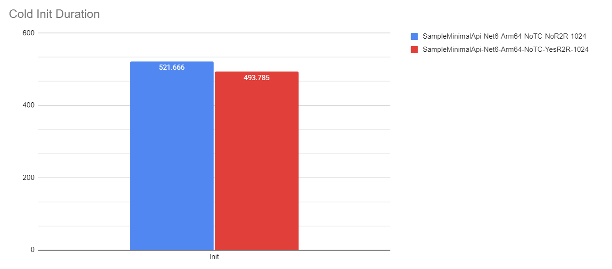
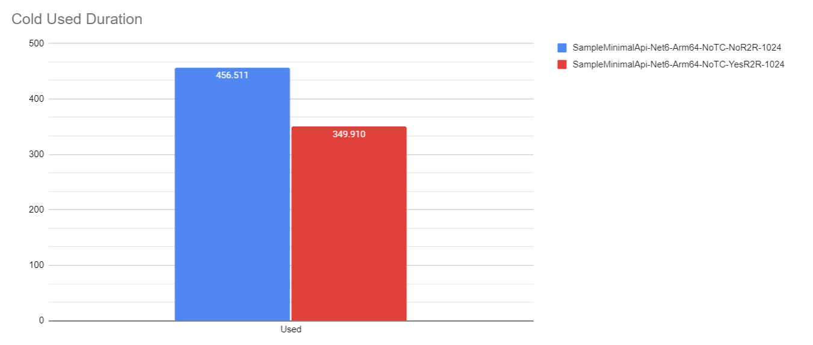
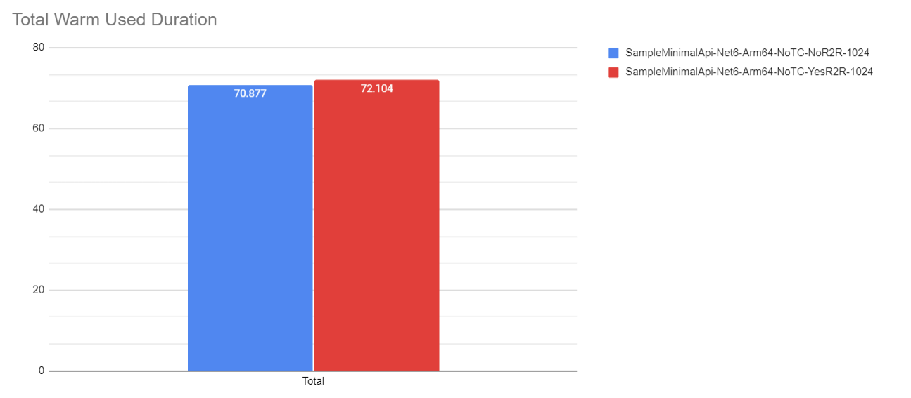
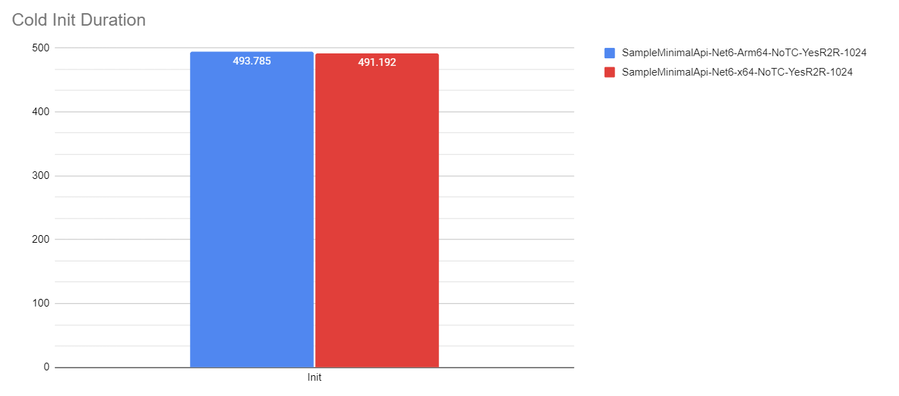
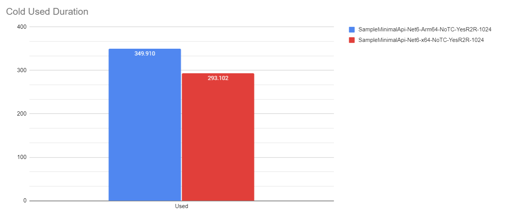
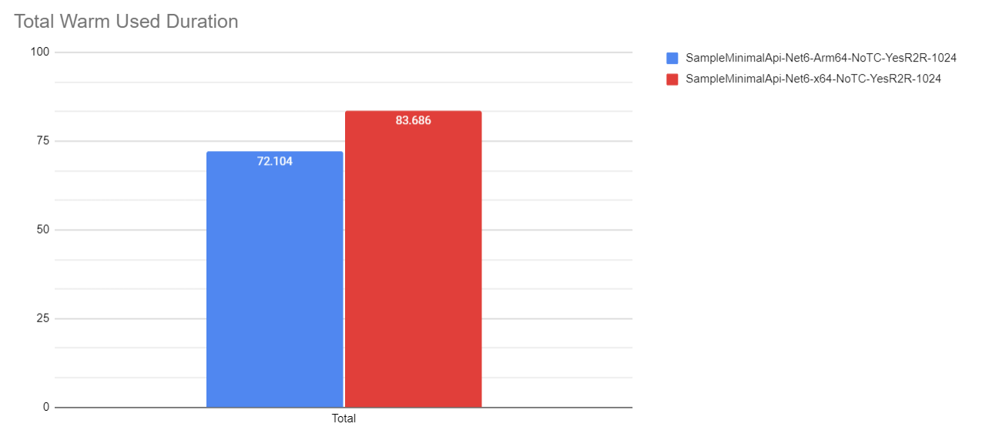
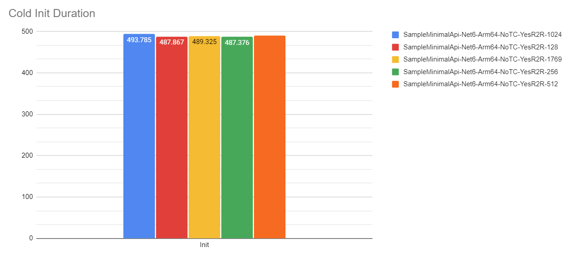
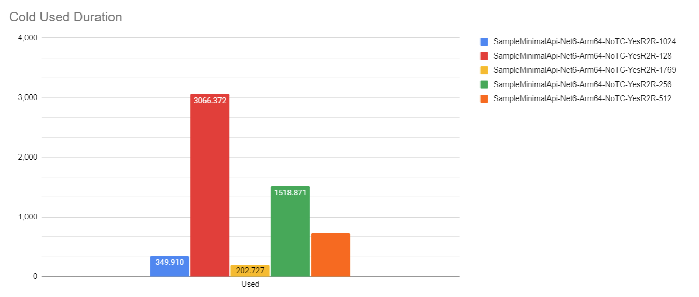
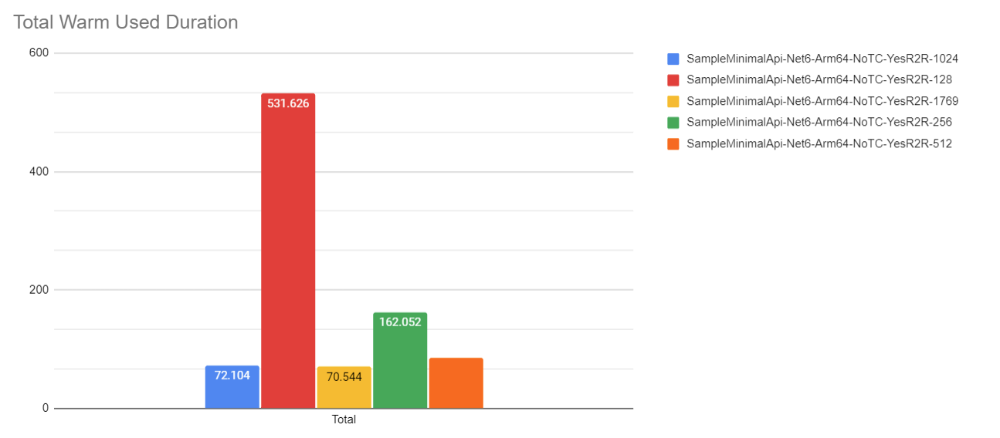

# Ready-to-Run Option

## Overview

_ReadyToRun_ is a form of ahead-of-time (AOT) compilation to improve startup performance by reducing the amount of work the just-in-time (JIT) compiler needs to do as your application loads. [Click here to learn more about _ReadyToRun_.](https://docs.microsoft.com/en-us/dotnet/core/deploying/ready-to-run)

## Minimal API, .NET 6 Runtime, 1024MB, Tiered Compilation Off, ARM64

## ARM64 vs. x64

## Memory Size: 128MB, 256MB, 512MB, 1024MB, vs. 1769MB

