# Tiered Compilation and Ready2Run Options

## Overview
_Tiered Compilation_ was first introduced in .NET Core 2.1. It allows the .NET runtime to emit different levels (tiers) of code quality. On startup, a quick-and-dirty method is preferred and then, over time, heavily called methods are substituted with more efficient code. [Click here to learn more about _Tiered Compilation_.](https://github.com/dotnet/runtime/blob/main/docs/design/features/tiered-compilation.md)

_ReadyToRun_ is a form of ahead-of-time (AOT) compilation to improve startup performance by reducing the amount of work the just-in-time (JIT) compiler needs to do as your application loads. [Click here to learn more about _ReadyToRun_.](https://docs.microsoft.com/en-us/dotnet/core/deploying/ready-to-run)

## Minimal Project

The purpose of the _Minimal_ project is to establish a baseline for all other .NET Lambda functions. Measurements of this Lambda function represent the lower bound of the AWS Lambda runtime for .NET projects.

### .NET 6 Runtime with 1024MB memory

#### Cold Start

For the _Minimal_ project, _Tiered Compilation_ significantly reduces the cold start duration of a Lambda invocation using the .NET 6 runtime. The impact is more dramatic on the ARM64 architecture where the invocation time drops from 327ms to 265ms (-19%) vs. the x86-64 architecture where it drops from 307ms to 282ms (-8.1%). In comparison, _ReadyToRun_ only provides a modest improvement to the cold start duration for the ARM64 architecture from 327ms to 319ms (-2.4%) and the x86-64 architecture from 307ms to 301ms (-2%). However, applying both options does not combine the performance gains. On the ARM64 architecture, combining _Tiered Compilation_ and _ReadyToRun_ (264ms) is virtually identical to applying _Tiered Compilation_ alone (265ms). However, for the x86-64 architecture, the benefits are cumulative and cold start duration drops from 307ms to 274ms (-11%).

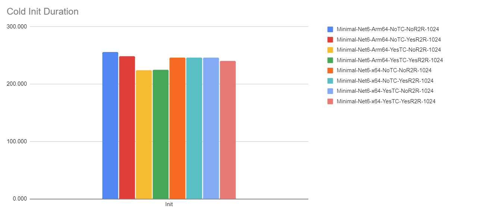
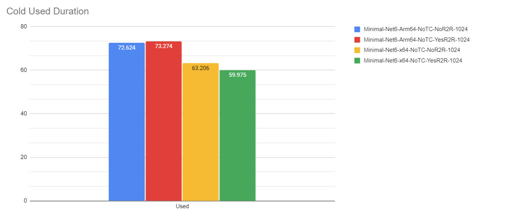

#### Warm Start

For warm invocations using the .NET 6 runtime, _Tiered Compilation_ also has a beneficial impact for the first warm invocation going from 5.345ms to 4.173ms (-22%) for the ARM64 architecture, and from 4.237ms to 3.544ms (-16%) for the x86-64 architecture. However, subsequent invocations suffer a performance penalty. For the ARM64 architecture, the average invocation time goes from 1.437ms to 1.645ms (+14%). And for the x86-64 architecture, it goes from 1.460ms to 1.712ms (+17%). In addition, invocation performance is choppier as the .NET runtime recompiles code.

##### _Tiered Compilation_ Enabled
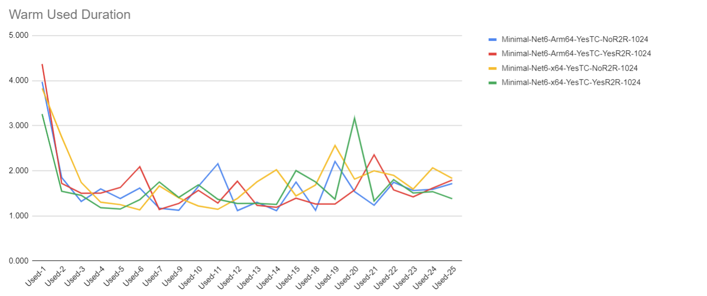

##### _Tiered Compilation_ Disabled
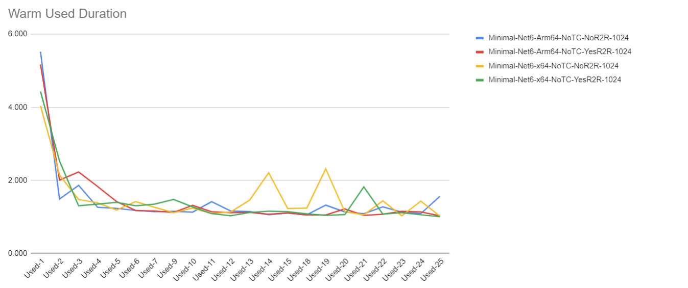

##### Total Warm Used Duration

The cumulative impact is readily visible when summing the warm start durations over the measurement period. Although, the first warm start invocation has a performance benefit, subsequent invocations erode it almost entirely.

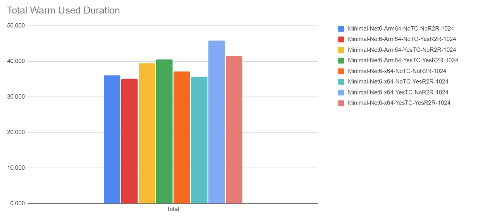


### .NET Core 3.1 Runtime with 1024MB memory

#### Cold Start

For the _Minimal_ project, _Tiered Compilation_ only modestly reduces the cold start duration of a Lambda invocation using the .NET Core 3.1 runtime. The impact is slightly higher on the ARM64 architecture where the invocation time drops from 166ms to 155ms (-6.6%) vs. the x86-64 architecture where it drops from 163ms to 158ms (-3.1%). _ReadyToRun_ provides no improvements to the cold start duration for the ARM64 and the x86-64 architecture. For the ARM64 architecture, combining _Tiered Compilation_ and _ReadyToRun_ (153ms) is virtually identical to applying _Tiered Compilation_ alone (155ms). However, for the x86-64 architecture, the benefits are cumulative and cold start duration drops from 163ms to 156ms (-4.2%).

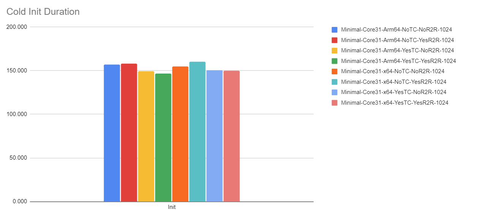
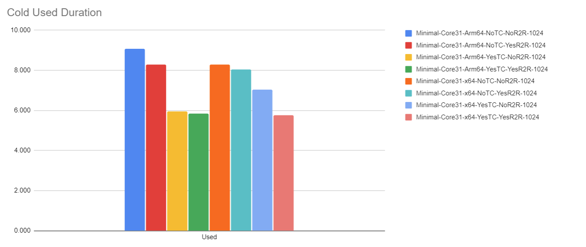

#### Warm Start

For warm invocations using the .NET Core 3.1 runtime, _Tiered Compilation_ introduces a performance penalty from the first warm invocation on. For the ARM64 architecture, the first warm invocation goes from 0.901ms to 0.972ms (+7.8%) and for the x86-64 architecture, it goes from 0.881ms to 0.951ms (+7.9%). The average of the remaining warm invocations goes from 0.786ms to 0.977ms (+24%) for the ARM64 architecture. And for the x86-64 architecture, it goes from 0.857ms to 1.085ms (+27%). In addition, invocation performance is choppier as the .NET runtime re-optimizes code.

##### _Tiered Compilation_ Enabled
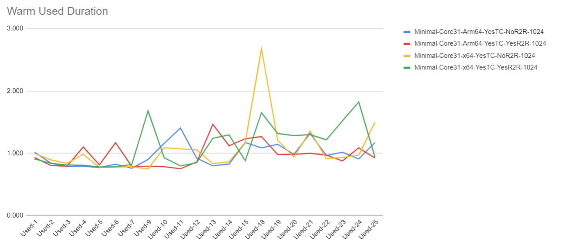

##### _Tiered Compilation_ Disabled
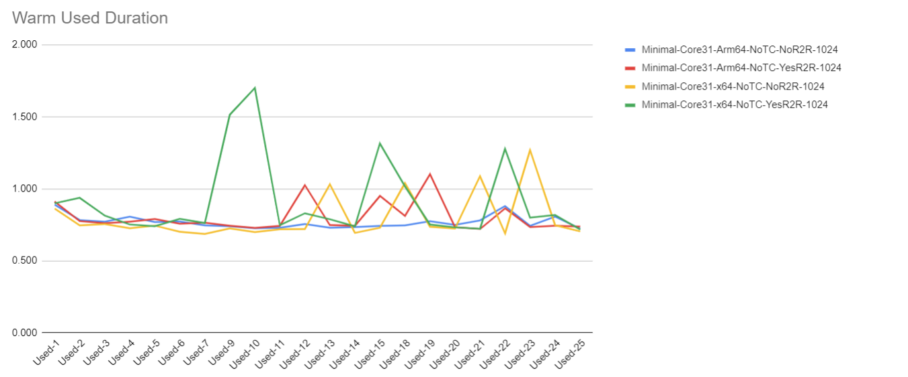

##### Total Warm Used Duration

The cumulative impact is readily visible when summing the warm start durations over the measurement period.


## Lambda Memory Configuration Impact on _Tiered Compilation_

The memory configuration for a Lambda function also determines how many vCPUs of processing power it gets during an invocation. At 1,769 MB, a function has the equivalent of one vCPU.

### .NET 6 Runtime

The .NET 6 runtime requires a lot more processing power to initialize, which causes performance to suffer significantly with low memory configurations, regardless of architecture. Enabling _Tiered Compilation_ further penalizes execution as the .NET runtime recompiles previously emitted code.

### ARM64 Architecture
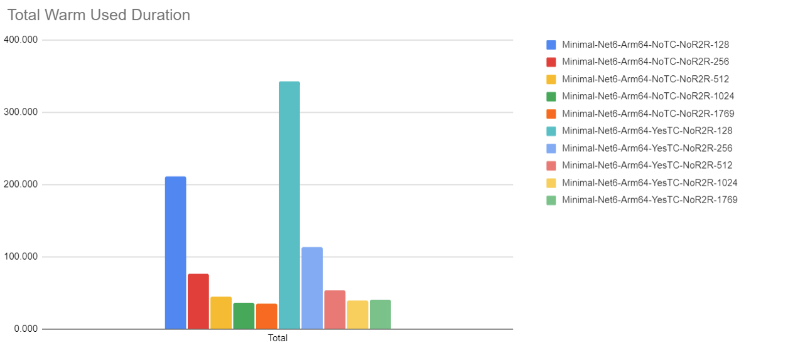

### x86-64 Architecture
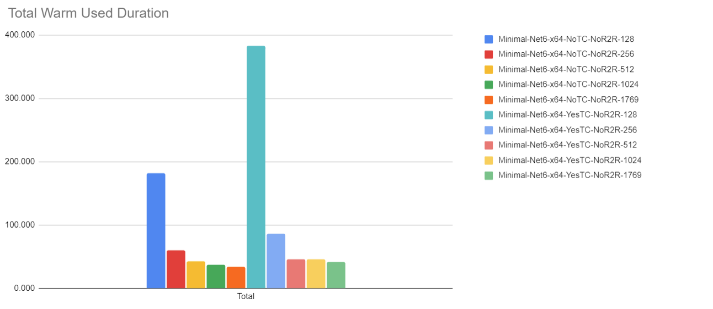


### .NET Core 3.1 Runtime

The .NET Core 3.1 runtime is very efficient on ARM64 architecture and runs fine for light workloads with 128MB configured. However, that is not the case for the x84-64 architecture. However, _Tiered Compilation_ sharply penalizes execution as the .NET runtime recompiles previously emitted code.

### ARM64 Architecture
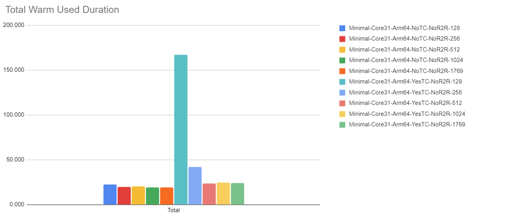

### x86-64 Architecture
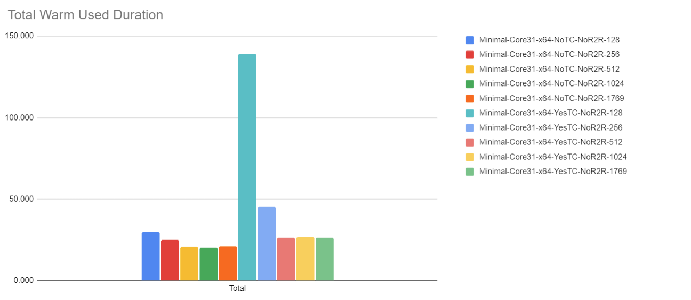

### Conclusion

The purpose of the _Minimal_ project is to establish a baseline for all other .NET Lambda functions. Measurements of this Lambda function represent the lower bound of the AWS Lambda runtime for .NET projects. Therefore, these results should not be used to anticipate real-world performance of actual applications. Project-specific measurements should be performed to validate assumptions based on these measurements.

Furthermore, performance numbers are so low with the _Minimal_ project that the calculations shown below will vary widely in practice. They should be seen as not as conclusive evidence, but as examples of how measurements can be used to make a decision if _Tiered Compilation_ and/or _ReadyToRun_ should be enabled for a given project.

#### .NET 6

For .NET 6 projects, _Tiered Compilation_ provides a significant performance gain for cold starts when the Lambda function is configured with 512MB of memory or more. However, this benefit erodes over time as warm invocations run slower. It is possible that performance of code emitted by _Tiered Compilation_ eventually becomes as performant as when this option is disabled, but that was not observed in the first 25 warm invocations. For Lambda functions with less than 512MB of memory, _Tiered Compilation_ should not be used as the recompilation operation is too expensive.

We can use simple arithmetic to determine the break-even point for the gains made from the cold start until the warm start overhead catches up. For example, using the ARM64 architecture measurements:

* Cold-start delta: 63ms (from 327ms to 264ms)
* First warm invocation delta: 1.172ms (from 5.345ms to 4.173ms)
* Subsequent warm invocation delta: -0.208ms (from 1.437ms to 1.645ms)
* => 309 warm invocations until the gains of the cold start are spent (+1 for first warm invocation)

Using these numbers, we should disable _Tiered Compilation_ if we expect our .NET 6 Lambda function to have 310 or more warm invocations. Other factors could also play in, such as consistency of warm invocations at the cost of a more expensive cold start.

The benefit of _ReadyToRun_ is even harder to determine. On the ARM64 architecture with _Tiered Compilation_ enabled, the cumulative warm invocation time is slightly greater than with this option disabled. However, on the x84-64 architecture, it does provide a performance improvement for warm invocations with, or without, _Tiered Compilation_ enabled.

#### .NET Core 3.1

For .NET Core 3.1 projects, _Tiered Compilation_ does not provide significant cold start gains as .NET Core 3.1 projects already have a much faster cold start than .NET 6 projects. Furthermore, for Lambda functions configured with less than 512MB of memory, _Tiered Compilation_ should not be used as the recompilation operation is too expensive.

Using the same arithmetic as before, we can determine the break-even point for the gains made from the cold start until the warm start overhead catches up. For example, using the ARM64 architecture measurements:

* Cold-start delta: 11ms (from 166ms to 155ms)
* First warm invocation delta: -0.071ms (from 0.901ms to 0.972ms)
* Subsequent warm invocation delta: -0.186ms (from 0.786ms to 0.977ms)
* => 59 warm invocations until the gains of the cold start are spent (+1 for first warm invocation)

Since the benefits are so small and the break-even count is so low, it is probably best to just avoid enabling _Tiered Compilation_ for .NET Core 3.1 projects.

The benefit of _ReadyToRun_ is equally questionable. On the ARM64 architecture with _Tiered Compilation_ enabled, the cumulative warm invocation time is virtually identical than with this option disabled. However, on the x84-64 architecture, it further degrades performance for warm invocations regardless of the _Tiered Compilation_ option.

## References

1. [Methodology for collecting measurements](Methodology.md)
1. Source code for measured projects
    1. [Minimal](../Projects/Minimal/)
    1. [AwsSdk](../Projects/AwsSdk/)
    1. [NewtonsoftJson](../Projects/NewtonsoftJson/)
    1. [SystemTextJson](../Projects/SystemTextJson/)
    1. [SourceGeneratorJson](../Projects/SourceGeneratorJson/)


## Appendix: Runtime Configuration

Note that the _Tiered Compilation_ option, while specified at build time, is actually a runtime option found in the `*.runtimeconfig.json` file colocated with the compiled assembly.

```json
{
  "runtimeOptions": {
    "tfm": "netcoreapp3.1",
    "framework": {
      "name": "Microsoft.NETCore.App",
      "version": "3.1.0"
    },
    "configProperties": {
      "System.Reflection.Metadata.MetadataUpdater.IsSupported": false,
      "System.Runtime.TieredCompilation": true,
      "System.Runtime.TieredCompilation.QuickJit": true
    }
  }
}
```
