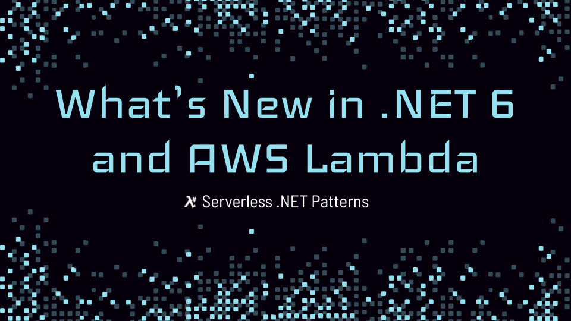

# LambdaSharp.Benchmark

This module is used to benchmark .NET AWS Lambda functions with different compilation and deployment options. The measurements are then collected into a CSV file for analysis.

## Presentation

<a href="https://youtu.be/fzLIqliRGrE"></a>

### Links from Presentation

* [When is the Lambda Init Phase Free, and when is it Billed?](https://bitesizedserverless.com/bite/when-is-the-lambda-init-phase-free-and-when-is-it-billed/)
* [Profiling functions with AWS Lambda Power Tuning](https://docs.aws.amazon.com/lambda/latest/operatorguide/profile-functions.html)
* [AWS Lambda Memory Vs CPU configuration](https://stackoverflow.com/questions/66522916/aws-lambda-memory-vs-cpu-configuration)
* [Benchmark .NET Lambda Projects with LambdaSharp.Benchmark](https://github.com/LambdaSharp/LambdaSharp.Benchmark)
* [Explore the results from the benchmarks in this public Google Sheet (LambdaSharp.Benchmark Explorer)](https://docs.google.com/spreadsheets/d/1ULCEIbXPXFWzv8m-FMnh6b0T4acgZDavJxwY7-NKGdo/edit?usp=sharing)

## Benchmarked Projects

1. [AwsSdk](Projects/AwsSdk/): benchmark using AWS .NET SDK ([Results](Data/AwsSdk%20(2022-06-02).csv))
1. [Minimal](Projects/Minimal/): minimal baseline project ([Results](Data/Minimal%20(2022-06-02).csv))
1. [NewtonsoftJson](Projects/NewtonsoftJson/): benchmark using Newtonsoft JSON.NET ([Results](Data/NewtonsoftJson%20(2022-06-02).csv))
1. [SampleAwsNewtonsoftTopLevel](Projects/SampleAwsNewtonsoftTopLevel/) ([Results](Data/SampleAwsNewtonsoftTopLevel%20(2022-06-03).csv))
1. [SampleAwsSystemTextJsonTopLevel](Projects/SampleAwsSystemTextJsonTopLevel/) ([Results](Data/SampleAwsSystemTextJsonTopLevel%20(2022-06-04).csv))
1. [SampleMinimalApi](Projects/SampleMinimalApi/) ([Results](Data/SampleMinimalApi%20(2022-06-03).csv))
1. [SourceGeneratorJson](Projects/SourceGeneratorJson/): benchmark using .NET 6+ source generators for JSON parsing ([Results](Data/SourceGeneratorJson%20(2022-06-02).csv))
1. [SystemTextJson](Projects/SystemTextJson/): benchmark using System.Text.Json ([Results](Data/SystemTextJson%20(2022-06-02).csv))


## Using LambdaSharp.Benchmark

The measurements were gathered using the _LambdaSharp.Benchmark_ module. Read more about the methodology in the [this document](Docs/Methodology.md).

### Module Deployment

_LambdaSharp.Benchmark_ uses the [LambdaSharp Tool](https://lambdasharp.net) for deployment. Once _LambdaSharp_ is set up, deploy _LambdaSharp.Benchmark_ directly from its published module. Alternatively, the module can also be deployed from a cloned repository. Deploying the module takes about 3 minutes.
```bash
lash deploy LambdaSharp.Benchmark@lambdasharp
```

Make note of the S3 bucket name shown at the end of the deployment. It is used to upload sample projects to benchmark and holds the measurements at the end.
```
$ lash deploy LambdaSharp.Benchmark@lambdasharp
LambdaSharp CLI (v0.8.4.0) - Deploy LambdaSharp module
Readying module for deployment tier <DEFAULT>
Resolving module reference: LambdaSharp.Benchmark@lambdasharp
=> Validating module for deployment tier

Deploying stack: LambdaSharp-Benchmark [LambdaSharp.Benchmark:1.0@lambdasharp]
=> Stack create initiated for LambdaSharp-Benchmark [CAPABILITY_IAM]
CREATE_COMPLETE    AWS::CloudFormation::Stack             LambdaSharp-Benchmark (2m 57.71s)
CREATE_COMPLETE    AWS::S3::Bucket                        BuildBucket (22.74s)
CREATE_COMPLETE    LambdaSharp::Registration::Module      Module::Registration (3.21s)
CREATE_COMPLETE    AWS::IAM::Role                         Module::Role (21.36s)
CREATE_COMPLETE    LambdaSharp::S3::EmptyBucket           EmptyBuildBucket (2.57s)
CREATE_COMPLETE    AWS::IAM::Role                         CodeBuild::Role (20.25s)
CREATE_COMPLETE    AWS::CodeBuild::Project                CodeBuild::Project (2.96s)
CREATE_COMPLETE    AWS::IAM::Policy                       Module::Role::DeadLetterQueuePolicy (18.51s)
CREATE_COMPLETE    AWS::Lambda::Function                  CombineMeasurementsFunction (9.69s)
CREATE_COMPLETE    AWS::Lambda::Function                  ListArtifactsFunction (8.77s)
CREATE_COMPLETE    AWS::Lambda::Function                  MeasureFunction (8.49s)
CREATE_COMPLETE    LambdaSharp::Registration::Function    ListArtifactsFunction::Registration (2.9s)
CREATE_COMPLETE    AWS::Logs::LogGroup                    MeasureFunction::LogGroup (2.42s)
CREATE_COMPLETE    LambdaSharp::Registration::Function    MeasureFunction::Registration (1.93s)
CREATE_COMPLETE    LambdaSharp::Registration::Function    CombineMeasurementsFunction::Registration (2.66s)
CREATE_COMPLETE    AWS::Logs::LogGroup                    ListArtifactsFunction::LogGroup (2.49s)
CREATE_COMPLETE    AWS::Logs::LogGroup                    CombineMeasurementsFunction::LogGroup (2.46s)
CREATE_COMPLETE    AWS::IAM::Role                         TestWorkflow::StepFunctionRole (19.57s)
CREATE_COMPLETE    AWS::Logs::SubscriptionFilter          MeasureFunction::LogGroupSubscription (0.7s)
CREATE_COMPLETE    AWS::Logs::SubscriptionFilter          ListArtifactsFunction::LogGroupSubscription (1.02s)
CREATE_COMPLETE    AWS::Logs::SubscriptionFilter          CombineMeasurementsFunction::LogGroupSubscription (0.83s)
CREATE_COMPLETE    AWS::StepFunctions::StateMachine       TestWorkflow::StepFunction (2.79s)
CREATE_COMPLETE    AWS::IAM::Policy                       WatchBucketFunctionPermission (18.58s)
CREATE_COMPLETE    AWS::Lambda::Function                  WatchBucketFunction (8.99s)
CREATE_COMPLETE    AWS::Lambda::Permission                WatchBucketFunction::Source1Permission (10.77s)
CREATE_COMPLETE    LambdaSharp::Registration::Function    WatchBucketFunction::Registration (2.94s)
CREATE_COMPLETE    AWS::Logs::LogGroup                    WatchBucketFunction::LogGroup (3.34s)
CREATE_COMPLETE    AWS::Logs::SubscriptionFilter          WatchBucketFunction::LogGroupSubscription (1.03s)
CREATE_COMPLETE    LambdaSharp::S3::Subscription          WatchBucketFunction::Source1Subscription (2.93s)
=> Stack create finished
Stack output values:
=> BuildBucketName = lambdasharp-benchmark-buildbucket-q9bvmyfoiizu
```

### Benchmarking

Identify a project to measure. Now add a `RunSpec.json` file to the project folder. This file contains the AWS Lambda entry point name and the JSON payload to use for the Lambda invocation.
```json
{
    "Handler": "SAMPLE-PROJECT::LAMBDA-FUNCTION-CLASS-NAME::METHOD-NAME",
    "Payload": "{\"message\":\"Hello World!\"}"
}
```

Second [zip](https://stackoverflow.com/questions/38782928/how-to-add-man-and-zip-to-git-bash-installation-on-windows) the contents of the folder, omitting any build files:
```bash
zip -9 -r SAMPLE-PROJECT.zip /MY-PROJECTS/SAMPLE-PROJECT -x "**/bin/*" -x "**/obj/*"
```

Then upload the zip file to the S3 bucket using the [AWS CLI](https://aws.amazon.com/cli/):
```bash
aws s3 cp "$ZIP_FILE" "s3://S3-BUCKET-NAME/Projects/SAMPLE-PROJECT.zip"
```

This will automatically kick-off the a step-function to build and benchmark the code. Once completed, the resulting CSV can be find in `Reports/` folder on the S3 bucket.

## Release History

### v1.1 (2022-07-30)

* Increased cold start sample size to 100
* Increased warm start sample size to 100
* Added measurement of pre-JIT Lambda option
* Added command to delete test Lambdas and their logs in case the measurement failed
* Added command to convert raw JSON files to CSV for more flexible post-processing
* Added SNS topic for notifying that the measurement step function is done

### v1.0 (2022-06-10)

* Initial release

## License

> Copyright (c) 2018-2022 LambdaSharp (λ#)
>
> Licensed under the Apache License, Version 2.0 (the "License");
> you may not use this file except in compliance with the License.
> You may obtain a copy of the License at
>
> http://www.apache.org/licenses/LICENSE-2.0
>
> Unless required by applicable law or agreed to in writing, software
> distributed under the License is distributed on an "AS IS" BASIS,
> WITHOUT WARRANTIES OR CONDITIONS OF ANY KIND, either express or implied.
> See the License for the specific language governing permissions and
> limitations under the License.
